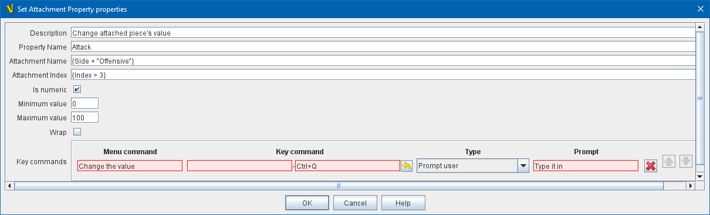

== VASSAL Reference Manual
[#top]

[.small]#<<index.adoc#toc,Home>> > <<GameModule.adoc#top,Module>> > <<PieceWindow.adoc#top,Game Piece Palette>> > <<GamePiece.adoc#top,Game Piece>> > *Set Attachment Property*#

'''''

=== Set Attachment Property

This trait allows a <<GamePiece.adoc#top,Game Piece>> to change the value of a <<DynamicProperty.adoc#top,Dynamic Property>> of a another piece attached via an <<Attachment.adoc#top,Attachment>> trait on this piece.

*Description:*::  A brief description of this trait for reference in the editor (not used during play).

*Property Name:*::  An <<Expression.adoc#top,Expression>> that defines the name of the property to be set.
Often, a specific Dynamic Property is simply listed by name, but it is possible to compute the name of the Dynamic Property to be changed based on other properties of this piece, e.g.,
_{ "Resources" + GetProperty("Side")_ }. In this case when the property Side holds the value "Allied" then the Global Property to be set will be _ResourcesAllied_.

*Attachment Name:*::  Matches the <<Attachment.adoc#top,Attachment>> trait with the designated attachment name. Often a specific attachment name is
simply listed by name, but several other possibilities are available:
+
* Leaving this field blank matches _all_ Attachment names on all of the Attachment traits on this piece.
+
* A specific attachment name can be computed with an expression, e.g., _{ Color + "Thingy" }_ might produce, e.g., _RedThingy_
+
* An expression resulting in the value _true_ and in which the name of the target attachment being considered is available as the local property _AttachmentName_, so for example _{ AttachmentName.contains("ammo") }_ would succeed for any attachment name that contained the string _ammo_.

*Attachment Basic Name or Index:*::  Matches attached pieces with a specific index. Indices start at 1. The index number can simply be designated, or several other formats can be used:
+
* Leaving this field blank matches _all_ attached pieces on any matching Attachment trait(s), as does index "0". This does indeed mean that the property values of multiple attached pieces could be altered by a single execution of this trait.
+
* A specific index number can be computed with a numerical expression, e.g., _2_ or _{ Which + 2 }_
+
* A specific BasicName can be computed with a string expression and will match with an attachment that has that BasicName property, e.g., _{ "Victory Points" }_
+
* An expression resulting in the value _true_ and in which the index of the target attachment being considered is available as the local property _AttachmentIndex_ and its BasicName property is available as _AttachmentBasicName_, so for example _{ AttachmentIndex > 3}_ or _{ AttachmentBasicName.contains("Front") }_. *NOTE:* Such expressions can result in _multiple_ attachments having their properties set, if multiple attachments match the criteria.

*Is numeric:*:: If true, then changes to the value of the property by this trait will be restricted to integer values.

*Minimum value:*::  Numeric values will be restricted to no less than this number when changed by this trait.

*Maximum value:*::  Numeric values will be restricted to no more than this number when changed by this trait.

*Wrap:*::  If true, then when incrementing this numeric property, values will wrap around from the maximum to the minimum and vice versa.

*Key commands:*::  Adds any number of commands for this piece, each of which will change the value of the designated property in the specified way.
+
For each Key Command:

*Menu command:*:::  Right-click context menu text for the command, or leave blank to display no context menu item.

*Key command:*:::  <<NamedKeyCommand.adoc#top,Keystroke or Named Command>> which will activate this change.

*Type:*:::  Select the way in which this command will change the property:
+
* _Set value directly:_  Set the property directly to the value of the <<Expression.adoc#top,Expression>> entered in the *New Value* field. The properties _AttachmentName_ and _AttachmentIndex_ are available in this context.
* _Increment numeric value:_  Increment the value of the property by the value of the <<Expression.adoc#top,Expression>> entered in the *Increment by* field.
To "decrement" the value, simple increment by a negative number.
* _Prompt user:_  Pop up a dialog and ask the user for a new value for the property.
They will be prompted for a new value using the text prompt entered in the *Prompt* field.
* _Prompt user to select from list:_  Similar to _Prompt User_ but displays a list of items to select from in a drop-down menu.
The items in the list can be generated dynamically by <<Expression.adoc#top,Expressions>>. If some items evaluate to a blank string, then those items are only purged from the menu if the <<GlobalOptions.adoc#purgeblanks,Purge Blanks option in Global Options>> is selected; otherwise the blank options appear.

*SEE ALSO:* <<Attachment.adoc#top,Attachment>>, <<Properties.adoc#top,Properties>>, <<DynamicProperty.adoc#top,Dynamic Property>>, <<SetGlobalProperty.adoc#top, Set Global Property>>, <<SetPieceProperty.adoc#top, Set Piece Property>>
