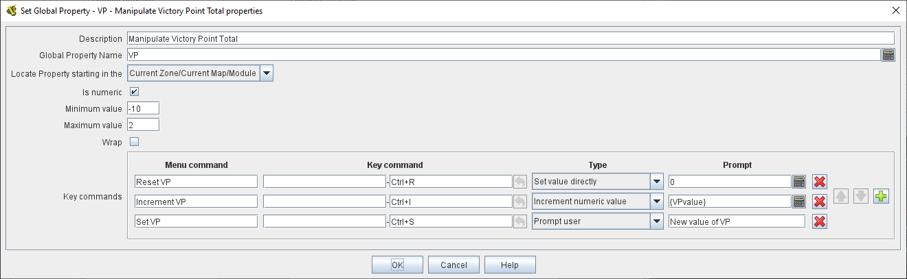

== VASSAL Reference Manual
[#top]

[.small]#<<index.adoc#toc,Home>> > <<GameModule.adoc#top,Module>> > <<PieceWindow.adoc#top,Game Piece Palette>> > <<GamePiece.adoc#top,Game Piece>> > *Set Global* *Property*#

'''''

=== Set Global Property

This trait allows a <<GamePiece.adoc#top,Game Piece>> to change the value of a <<GlobalProperties.adoc#top,Global Property>>.

*Description:*::  A brief description of this trait for reference in the editor (not used during play).

*Global Property Name:*::  An <<Expression.adoc#top,Expression>> that defines the name of the property to be set.
Often, a specific Global Property is simply listed by name, but it is possible to compute the name of the Global Property to be changed based on other properties of the piece, e.g.
_{ "Resources" + GetProperty("Side")_ }. In this case when the property Side holds the value "Allied" then the Global Property to be set will be _ResourcesAllied_.

*Locate Property starting in the:*:: Define how to locate the Global Property that will have its value changed

_Current Zone/Current Map/Module_:::
Look for the Global property first in the Zone the piece is currently on. If not found, then look for it in the Map the piece is currently in. If still not found, then check for a module level Global Property.
_Named Zone_:::
Look for the Global Property in the Named Zone on the Map the piece is currently on. If not found, look for a Map level Global Property on the current Map, then look for a module level Global Property.
_Named Map_:::
Look for a Map level Global property on the Named Map. The piece does not have to be on this map. If not found, then look for a module level Global Property.

*Name of Zone containing property:*::
An <<Expression.adoc#top,Expression>> defining the name of the Zone to look in for the Global Property.

*Name of Map containing property:*::
An <<Expression.adoc#top,Expression>> defining the name of the Map to look in for the Global Property.

*Is numeric:*:: If true, then changes to the value of the property by this trait will be restricted to integer values.
*Is numeric:*:: If true, then changes to the value of the property by this trait will be restricted to integer values.

*Minimum value:*::  Numeric values will be restricted to no less than this number when changed by this trait.

*Maximum value:*::  Numeric values will be restricted to no more than this number when changed by this trait.

*Wrap:*::  If true, then when incrementing this numeric property, values will wrap around from the maximum to the minimum and vice versa.

*Key commands:*::  Adds any number commands for this piece, each of which will change the value of the designated property in the specified way.
+
For each Key Command:

*Menu command:*:::  Right-click context menu text for the command, or leave blank to display no context menu item.

*Key command:*:::  <<NamedKeyCommand.adoc#top,Keystroke or Named Command>> which will activate this change.

*Type:*:::  Select the way in which this command will change the property:
+
* _Set value directly:_  Set the property directly to the value of the <<Expression.adoc#top,Expression>> entered in the *New Value* field.
* _Increment numeric value:_  Increment the value of the property by the value of the <<Expression.adoc#top,Expression>> entered in the *Increment by* field.
To "decrement" the value, simple increment by a negative number.
* _Prompt user:_  Pop up a dialog and ask the user for a new value for the property.
They will be prompted for a new value using the text prompt entered in the *Prompt* field.
* _Prompt user to select from list:_  Similar to _Prompt User_ but displays a list of items to select from in a drop-down menu.
The items in the list can be generated dynamically by <<Expression.adoc#top,Expressions>>.

*SEE ALSO:* <<PropertyMarker.adoc#top,Marker>>, <<DynamicProperty.adoc#top,Dynamic Property>>, <<Properties.adoc#top,Properties>>
