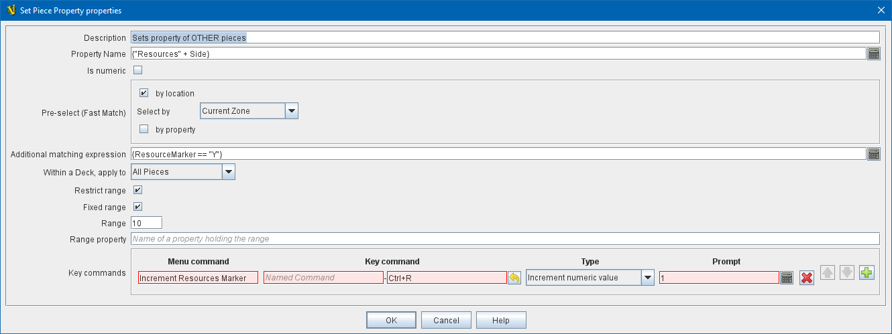

== VASSAL Reference Manual
[#top]

[.small]#<<index.adoc#toc,Home>> > <<GameModule.adoc#top,Module>> > <<PieceWindow.adoc#top,Game Piece Palette>> > <<GamePiece.adoc#top,Game Piece>> > *Set Piece Property*#

'''''

=== Set Piece Property

This trait allows a <<GamePiece.adoc#top,Game Piece>> to change the value of an existing <<DynamicProperty.adoc#top,Dynamic Property>> in one or more _other_ pieces which match a provided expression and fast-match context.

*Description:*::  A brief description of this trait for reference in the editor (not used during play).

*Property Name:*::  An <<Expression.adoc#top,Expression>> that defines the name of the property to be set.
A specific Dynamic Property can simply be listed by name, but it is possible to compute the name of the Dynamic Property to be changed based on other properties of this piece, e.g.
_{ "Resources" + GetProperty("Side")_ }. In this case when the property Side holds the value "Allied" then the Dynamic Property to be set will be _ResourcesAllied_.

NOTE: The <<DynamicProperty.adoc#top,Dynamic Property>> trait must exist on the target pieces. This trait does not 'create' new <<DynamicProperty.adoc#top,Dynamic Properties>>.

*Over-ride numeric constraints in target properties:*:: If left unticked, then the Set Property Piece trait will use whatever (if any) numeric constraints have been specified in the Dynamic Properties that it updates.  If ticked, then the following 4 options appear and allow you to ignore or override any numeric constraints in the target property.

*Is numeric:*:: If true, then changes to the value of the property by this trait will be restricted to integer values. If left unticked, then the following 3 options do not appear and this trait will set exactly the value specified.

*Minimum value:*::  Numeric values will be restricted to no less than this number when changed by this trait.

*Maximum value:*::  Numeric values will be restricted to no more than this number when changed by this trait.

*Wrap:*::  If true, then when incrementing this numeric property, values will wrap around from the maximum to the minimum and vice versa.

*Pre-select (Fast Match):*:: Fast match expressions help filter which pieces will have their property/properties set. See <<FastMatch.adoc#top, Fast Match>> for details.

*Additional matching expression:*::  If further refinement of which target pieces should have their property/properties set is needed, or if you do not wish to use Fast Match pre-selections, an Additional Matching Expression can be used. Properties will only be set on Game Pieces which match the specified <<PropertyMatchExpression.adoc#top,Property Match Expression>>.
+
Note that the properties named in _this_ expression are evaluated against the properties _of the target pieces_, not the properties of the piece issuing the Set Piece Property.
+
For example if you provided the expression _{ CurrentZone == "Europe" }_, that would use the CurrentZone property of each potential target piece (checking if _it_ is "Europe") to determine whether to apply the property change.
+
If you want to compare a property in the target pieces against the value of _a property in *this* piece_, then use $property$. All $...$ property references will be evaluated against this piece before testing against other pieces.
+
Note that this will often mean the expression needs to be put inside of quotation marks if the property in question is a string value.
For example if the expression provided is { CurrentZone == "$CurrentZone$" } then the CurrentZone of each potential target piece will be checked against $CurrentZone$ which will read the CurrentZone of the _issuing_ piece.

*Within a Deck, apply to:*::  Select how the property change will be applied to pieces in a <<Deck.adoc#top,Deck>>. Options are _All pieces_, _No pieces_, or _Fixed number of pieces_.
If _Fixed number of pieces_ is selected, a field appears to allow entry of the number of Pieces in the Deck to affect, starting at the top of the Deck.
Thus, selecting 1 for the fixed number would cause only the top card or piece in a Deck to be affected. As of VASSAL 3.6, an <<Expression.adoc#top,Expression>> can be used. Note that such an expression will be evaluated _once_ at the beginning of the property set operation (not each time a candidate piece is being checked).

*Restrict Range:*::  If selected, the property change will only apply to pieces located within a specified distance of this piece.<<Properties.adoc#top>>

*Range:*:: Only others pieces within this distance, inclusive, of this piece will have the property change applied to them.
If the pieces are on a board with a <<HexGrid.adoc#top,Hex Grid>> or <<RectangularGrid.adoc#top,Rectangular Grid>>, then the distance is in units of the grid.
Otherwise, the distance is measured in screen pixels.

*Fixed Range:*::  If selected, then the range is specified as a fixed number.
If unselected, then the range will be given by the value of the named <<Properties.adoc#top,property>>.

*Range Property:*::  The name of a Property that contains the range to use when Fixed Range is not selected.

*Key commands:*::  Adds any number of commands for this piece, each of which will change the value of the designated property in the specified way.
+
For each Key Command:

*Menu command:*:::  Right-click context menu text for the command, or leave blank to display no context menu item.

*Key command:*:::  <<NamedKeyCommand.adoc#top,Keystroke or Named Command>> which will activate this change.

*Type:*:::  Select the way in which this command will change the property:
+
* _Set value directly:_  Set the property directly to the value of the <<Expression.adoc#top,Expression>> entered in the *New Value* field. The properties _AttachmentName_ and _AttachmentIndex_ are available in this context.
* _Increment numeric value:_  Increment the value of the property by the value of the <<Expression.adoc#top,Expression>> entered in the *Increment by* field.
To "decrement" the value, simple increment by a negative number.
* _Prompt user:_  Pop up a dialog and ask the user for a new value for the property.
They will be prompted for a new value using the text prompt entered in the *Prompt* field.
* _Prompt user to select from list:_  Similar to _Prompt User_ but displays a list of items to select from in a drop-down menu.
The items in the list can be generated dynamically by <<Expression.adoc#top,Expressions>>. If some items evaluate to a blank string, then those items are only purged from the menu if the <<GlobalOptions.adoc#purgeblanks,Purge Blanks option in Global Options>> is selected; otherwise the blank options appear.
+
NOTE: Note that the properties named in this expression are evaluated against the properties of the target pieces, *NOT* the properties of the piece issuing the Set Piece Property +
If you want to use a property in *this* piece in an expression here, then use $property$. All $...$ property references will be evaluated against this piece before the final expression is evaluated using properties from the target piece.  E.g., Incrementing a property using the expression `{$p1$ + p2}` will add the value of the `p1` property from this piece, plus the value of the `p2` property from the target piece.

*SEE ALSO:* <<Attachment.adoc#top,Attachment>>, <<Properties.adoc#top,Properties>>, <<DynamicProperty.adoc#top,Dynamic Property>>, <<SetGlobalProperty.adoc#top, Set Global Property>>
