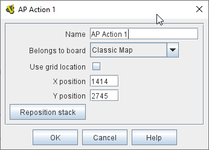
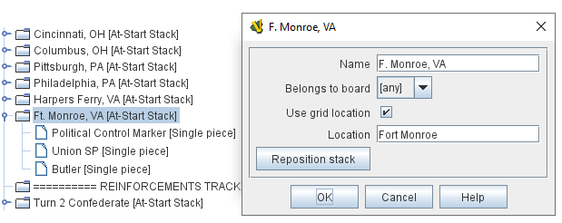

== VASSAL Reference Manual
[#top]

[.small]#<<index.adoc#toc,Home>> > <<GameModule.adoc#top,Module>> > <<Map.adoc#top,Map>> > *At-Start Stack*#

'''''

=== At-Start Stack

An At-Start Stack is an ordinary stack of playing pieces that is initialized in a specified map location at the beginning of every game.
It can be used to place pieces in their starting positions (particularly when the starting positions are true regardless of scenario). It is also appropriate for any fixed pool of counters.
When the game begins, the pieces are in place just as if they had been dragged from the Game Piece Palette, except that no more can be created during the course of the game.

To add an _At-Start Stack_, navigate to the entry for your Map in the Editor, right-click on the _[Map]_ component entry, and select _Add At-Start Stack_.
Then, right-click on the _[At-Start Stack]_ component entry created at the bottom of your Map's list of sub-components, and select _Add Single Piece_ to add a piece to the stack.
You can add as many pieces as you wish to each At-Start Stack.

*EXAMPLE:*  A strategic game in which a nationality has a fixed force pool of Infantry, Armor, etc.
counters can be modeled by making a Map Window representing the force pool, with an At-Start Stack of Infantry counters, an At-Start Stack of Armor counters, etc.
In order to guarantee that the number of each type of counter is fixed, the Clone and Delete functions of the Infantry and Armor counters should be disabled.

*EXAMPLE (see illustration):*  A card-driven strategy game in which the Union player begins with a Political Control marker, a single SP or "strength point", and General Butler in Ft.
Monroe, VA.
An _At-Start Stack_ is created and assigned to use the grid location of Ft.
Monroe.
Then, a _Political Control_ single piece, a _Union SP_ single piece, and a _Butler_ single piece are added to the stack.
As in real life, the first counter placed in a location goes "on the bottom" and each successive counter is placed above it.
Thus, General Benjamin "Spoons" Butler will appear on top of his stack.

[width="100%",cols="50%a,^50%a",]
|===
|
*Name:* :: The name is not used during game play.
It exists simply for identification and organization in the module editor.

*Belongs to board:*::  If a board name is selected, the stack will appear only on that particular Board.
If a game does not use that Board, then the stack will not appear.
If "<any>" is selected, then the stack will always appear at the given position, regardless of the board(s) in use.

*Use grid location:*::  If selected, you can enter the position of the stack using a descriptive location name.
Otherwise, you must specify X and Y coordinates.

*X,Y position:*::  The position in the Map Window of the center of the stack.
If this stack belongs to a Board, the position is relative to the Board's position in the Map Window.

*Reposition Stack:*::  Click this button to use the graphical interface to reposition the stack on the board.
The image of one of the pieces in the stack, if defined, will be used to help you visualize and adjust the stack's starting position.

*Location:*::   The location of the stack as a descriptive location label as returned by <<GridNumbering.adoc#top,Grid Numbering>>, or the name of a <<IrregularGrid.adoc#top,Region>> in the case of an <<IrregularGrid.adoc#top,Irregular Grid>>. The grid numbering system must provide enough information to define a specific location on the map (for example, $gridLocation$). However, if a zone in a <<ZonedGrid.adoc#top,Multi-Zone Grid>> does not specify a grid, the center of the zone will be selected.

|

image:images/AtStartStackExample.png[]

|===

'''''

=== Sub-Components

==== <<GamePiece.adoc#top,Single Piece>>

An At-Start Stack can contain any number of Game Pieces.
Right-click on the _[At-Start Stack]_ component in the Editor and select _Add Single Piece_ to add a piece to the At-Start Stack.
You can then open the properties for the _[Single Piece]_ to define it.
Adding a <<UsePrototype.adoc#top,Prototype>> trait reference is often the quickest and most efficient way to define pieces.
