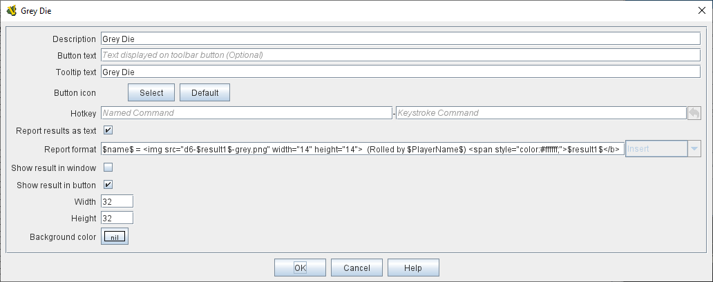

== VASSAL Reference Manual
[#top]

[.small]#<<index.adoc#toc,Home>> > <<GameModule.adoc#top,Module>> > *Symbolic Dice Button*#

'''''

=== Symbolic Dice Button
A Symbolic Dice Button places a button on the <<Toolbar.adoc#top,Toolbar>> which rolls dice that use graphical images to display their faces -- in simpler terms, "dice that look like dice". A Symbolic Dice Button can roll one or more individual dice, each represented by a _[Symbolic Die]_ component, each of which may in turn have any number of faces (represented by _[Symbolic Die Face]_ sub-components). When the button is clicked, a random face is selected for each Symbolic Die that this component contains.
The results of the roll can be reported as text into the chat area, and/or graphically in a separate window and/or in the button itself.

To add a Symbolic Dice Button to your module, right-click on the main _[Module]_ entry at the very top of the Editor's configuration window, and select _Add Symbolic Dice Button_.
Then, once you do the initial configuration of its options, navigate to the _[Symbolic Dice Button]_ component that will have been added at the very end of the Module's list of components.
Right-click on the _[Symbolic Dice Button]_ entry, and select _Add Symbolic Die_.
If you wish this button to roll more than one die, you can also add more.
Then, you will need to right-click each _[Symbolic Die]_ entry, and select _Add Symbolic Die Face_ once for each face of the desired die (so a 6-sided Symbolic Die would have six Symbolic Die Face sub-components). You can then configure each of the components and sub-components.

[width="100%",cols="50%a,^50%a",]
|===
|
*Description:*:: The name of the dice button.

*Button text:*::  Text for the <<Toolbar.adoc#top,Toolbar>> button in the main window.

*Tooltip text:*::  Optional tooltip text for the <<Toolbar.adoc#top,Toolbar>> button in the main window.

*Button icon:*:: The image to display on the Toolbar button.

*Hotkey:*:: <<NamedKeyCommand.adoc#top,Keystroke or Named Command>> for rolling the dice.

*Report results as text:*::  If true, report results to the <<ChatLog.adoc#top,Chat Log>>.

*Report format:*::  A <<MessageFormat.adoc#top,Message Format>> specifying the format for reporting text results: _$name$_ is the name of the button as specified above, __$result1$, $result2$, etc__is the result of the 1st, 2nd, etc.
_[Symbolic Die]_ component.
_$numericalTotal$_ is the sum of the numerical values all of the Symbolic Die rolls.

NOTE:  as of Vassal 3.3.3 these reports can include HTML tags, including __ tags to place dice images directly into the chat log (see example below).

*Show result in window:*::  If true, show the results graphically in a standalone window.

*Window title format:*::  A <<MessageFormat.adoc#top,Message Format>> specifying the format for reporting results to the titlebar of the standalone window.

*Show result in button:*::  If true, show the results graphically in the toolbar button itself, by displaying the image of the appropriate _[Symbolic Die Face]_.

*Width:*::  The width of the area for displaying results graphically.

*Height:*::  The height of the area for displaying results graphically.

*Background color:*::  The background color to be used when displaying results graphically.

|image:images/SpecialDiceToolbar.png[]

image:images/SpecialDiceButton.png[]

|===

*EXAMPLE - HTML with Dice:*  In the illustration below, a Symbolic Dice Button is configured to use HTML in its report format in order to display an image of the dice result in the chat log.
Notice how the tag __ uses the $result1$ value to index the name of a png file to be displayed.
Then, the _width="14" height="14"_ portion forces the dice images to be scaled to the height of the text in the chat log.
Later, the _$result1$_ section displays a text version of the numerical result, but in "white-on-white" text which will be invisible unless the text is selected to be cut-and-paste into another window, thus preserving the numeric value in case the chat log is cut-and-paste into a different application.

Example of a Symbolic Die configured to display dice images inline in the <<ChatLog.adoc#top,Chat Log>>. The _$result1$_ property is used to index the correct image filename.

'''''

=== Sub-Components

==== Symbolic Die

Once you've added a Symbolic Die to your Symbolic Dice Button (by right-clicking the _[Symbolic Dice Button]_ component entry in the editor and selecting _Add Symbolic Die_), you can then right-click its own _[Symbolic Die]_ component entry and select _Add Symbolic Die Face_.
You'll need to add one _[Symbolic Die Face]_ for each "side" the die will have.
So a traditional 6-sided die would of course need six die faces, though you can create dice with any number of faces desired, no matter how geometrically improbable!

[width="100%",cols="50%a,^50%a",]
|===
|*Name:*::  The name of the die

*Results format:*::  A <<MessageFormat.adoc#top,Message Format>> specifying how to report the result of this die roll.
The resulting text will be substituted for _$result1$, $result2$,_ etc in the Symbolic DiceButton's results format: _$name$_ is the name of this die as specified above, _$result$_ is the text value of the Symbolic Die Face that is rolled, _$numericalValue$_ is the numerical value of the Symbolic Die rolled.

|image:images/SpecialDiceExample.png[] +
|===

==== Symbolic Die Face
Each die face contains a text value, a numerical value, and an image.

[width="100%",cols="50%a,^50%a",]
|===
|*Text value:*:: A text representation of the Face to be used in reports.

*Numerical value:*:: A numerical value of the Face to be used in totalling results.

*Icon:*:: The image to use for the Face.

|
image:images/SpecialDie.png[]

image:images/SpecialDieFace.png[]
|===
