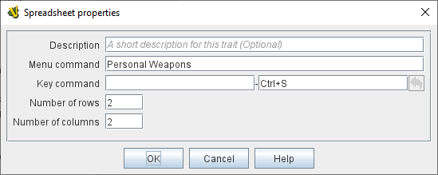

== VASSAL Reference Manual
[#top]

[.small]#<<index.adoc#toc,Home>> > <<GameModule.adoc#top,Module>> > <<PieceWindow.adoc#top,Game Piece Palette>> > <<GamePiece.adoc#top,Game Piece>> > *Spreadsheet*#

'''''

=== Spreadsheet

[cols=",",]
|===
|This trait attaches an editable table of data to a <<GamePiece.adoc#top,Game Piece>>. Specify the number of rows and columns in the table, a key command to open the table, and name of the item in the right-click context menu.

To initialize the values in the table, select the piece in the <<PieceWindow.adoc#top,Game Piece Palette>> (or the properties window for the piece), open the spreadsheet with the key command or context menu and enter the starting values.

*Menu Command:*  Text for a right-click context menu item that will open the spreadsheet window.

*Keyboard Command:*  The key command or <<NamedKeyCommand.adoc#top,Named Key Command>> to open the spreadsheet.

*Number of rows:*  The number of rows of data in the spreadsheet.

*Number of columns:*  The number of columns of data in the spreadsheet.

As of the present version of Vassal, the values in the spreadsheet are _not_ exposed as properties that can be accessed by other traits.
| +
image:images/Spreadsheet2.png[]
|===
