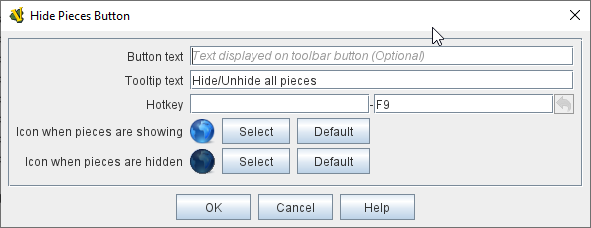
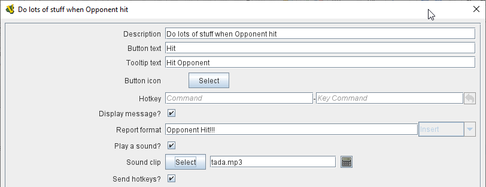

== VASSAL Reference Manual
[#top]

[.small]#<<index.adoc#toc,Home>> > <<GameModule.adoc#top,Module>> > *Toolbar*#

'''''

=== Toolbar

image:images/Toolbar.png[]

The <<Toolbar.adoc#top,Toolbar>> of the main <<GameModule.adoc#top,Module>> window contains buttons for basic functions such as <<#Undo,Undo>>, <<#StepForward,Step Forward>>, and <<#ServerControls,Server Controls>>, but you can also configure buttons to <<SpecialDiceButton.adoc#top,roll dice>>, <<PieceWindow.adoc#top,add pieces to the map>>, display <<Chartwindow.adoc#top,charts>> and <<Map.adoc#top,maps>>, keep <<PlayerHand.adoc#top,player hands>> and <<PrivateWindow.adoc#top,reinforcement pools>> private, and more.

Buttons for basic functions are created by configuring the existing basic components of the module, such as <<GlobalOptions.adoc#top,[Global Options>>] and the <<#Definition_of_Player_Sides,Definition of Player Sides>>.

Buttons for Maps, Charts, Dice, and other additional buttons are created by adding new <<GameModule.adoc#SubComponents,Sub-Components>> to the Module.
In some cases, Toolbar buttons can also be created by adding sub-components to a Map window.

=== Toolbar Configuration
[#toolbarconfig]

[width="100%",cols="50%,^50%",]
|===
a|
Although there are many types of toolbar buttons (see below), most of them share certain basic configuration fields.

**Name:**:: The name of the component in case it needs to be referred to somewhere else.

**Button Text:**:: Text that will be displayed as part of the toolbar button. Buttons can include an image, a text message, or both. Neither are required (but a button with neither an image nor any text will be invisible and can only be activated by its hotkey).

**Tooltip Text:**:: Explanatory tooltip text explaining what the button is for and/or how to use it.

**Button Icon:**:: Icon that will be displayed as part of the toolbar button. Buttons can include an image, a text message, or both. Neither are required (but a button with neither an image nor any text will be invisible and can only be activated by its hotkey).

**Hotkey:**:: A keystroke that will serve as a hotkey for activating this button. Alternatively a <<NamedKeyCommand.adoc#top,Named Key Command>>  can be used.

**Toolbar button can be disabled by a property:**:: If this box is checked, you will be able to enable/disable the Toolbar Button by changing the value of a Global Property.

**Global Property to disable this button when "true"**:: The name of a <<GlobalProperties.adoc#top,Global Property>> that will control when this Toolbar Button is enabled or disabled. If the property contains the string _true_,  the button will be disabled; if it contains any other value the button will be enabled.

**Button Icon when disabled:**:: If you select an alternative icon here, then that icon will be used when the button is currently disabled. If you leave the icon empty, then the normal icon, if any, will stay in place. Any button text for the toolbar button will be greyed out when the button is disabled, regardless of your choice in this field.

a|
image:images/ToolbarConfig.png[]
_Standard toolbar configuration fields_
|===

=== List of Toolbar Components

[cols=",,,",]
|===
|<<DoActionButton.adoc#top,Action Button>> |<<PieceWindow.adoc#top,Add Game Pieces>> |<<GlobalProperties.adoc#ChangePropertyToolbarButton,Change-Property Toolbar Button>> |<<ChartWindow.adoc#top,Charts>>
|<<Map.adoc#MarkUnmoved,Clear Move History>> |<<GameModule.adoc#DiceButton,Dice Button>> |<<PieceWindow.adoc#top,Game Piece Palette>> |<<Map.adoc#GlobalKeyCommand,Global Key Command>>
|<<GamePieceLayers.adoc#GamePieceLayerControl,Hide Layers>> |<<Map.adoc#HidePieces,Hide Pieces>> |<<Map.adoc#top,Maps>> |<<Map.adoc#MarkUnmoved,Mark Unmoved Button>>
|<<MultiActionButton.adoc#top,Multi-Action Button>> |<<PlayerHand.adoc#top,Player Hand>> |<<PrivateWindow.adoc#top,Private Window>> |<<GameModule.adoc#RandomTextButton,Random Text Button>>
|Retire |<<#ServerControls,Server controls>> |<<SpecialDiceButton.adoc#top,Symbolic Dice Button>> |<<#SwitchSides,Switch Sides>>
|<<#Undo,Undo>> |<<Map.adoc#Zoom,Zoom Controls>> | |
|===

'''''

=== Basic Toolbar Buttons

[width="100%",cols="50%,^50%",]
|===
a|
[#Undo]
==== Undo

An Undo button allows players to back up one or more steps, undoing those moves and/or actions, if a mistake has been made.
An Undo button can be added by configuring the <<GlobalOptions.adoc#top,[Global Options>>] component of the main <<GameModule.adoc#top,Module>>. The Undo button can be given a button image and a hotkey.

[#StepForward]
==== Step Forward

The Step Forward button is how play-by-email (PBEM) players can step forward through an opponent's actions when loading a LogFile (VLOG) file from them.
Upon loading the log file, the Step Forward button will become "active", and the player viewing the log can use the button to step forward a move at a time.
Once the log file reaches its end, the Step Forward button will grey back out again and the player can make the next moves.
The Step Forward button is configured in the <<GlobalOptions.adoc#top,[Global Options>>] component of the main <<GameModule.adoc#top,Module>>: it can be given an image and a hotkey.

[#ServerControls]
==== Server Controls

The Server Controls button opens the sub-window that allows online players to communicate with a VASSAL Server to find and begin online games.
The Server Controls button is configured in the <<GlobalOptions.adoc#top,[Global Options>>] component of the main <<GameModule.adoc#top,Module>>: it can be given an image and a hotkey.

[#Retire]
[#SwitchSides]
==== Retire / Switch Sides

The Retire button (or in some modules, the Switch Sides) is configured in the <<GameModule.adoc#Definition_of_Player_Sides,Definition of Player Sides>>, a sub-component of the Module itself.
If the button is given either button text or a button icon, it will appear on the Toolbar and allow players to switch between sides (e.g.
in a "hotseat" game), become an observer, and/or select a side they want to play.

a|
image:images/GlobalOptions.png[]

Global Options (Undo, Step Forward, and Server Controls buttons)

image:images/PlayerSides.png[]

Retire or Switch Sides, in <<GameModule.adoc#Definition_of_Player_Sides,Definition of Player Sides>>

|===

'''''

=== Pieces and Hands

Several types of Toolbar button can be configured to provide places to bring pieces onto the board.

[width="100%",cols="50%,^50%",]
|===
a|

A Game Piece Palette allows an unlimited number of pieces to be created and placed onto any map.
This can have several uses -- it can be used as an unlimited supply for certain counters and markers during play.
One can also fleshed out with the full counter-set and used as a place from which to set up a game initially to create <<GameModule.adoc#PredefinedSetup,Predefined Scenarios>>.

A module can have more than one Game Piece Palette, each with its own Toolbar button.
Or, a single Game Piece Palette can have any number of tabs and sub-panels.

<<PieceWindow.adoc#top,See full article for details.>>

a|
image:images/PaletteExample.png[]

A <<PieceWindow.adoc#top,Game Piece Palette>> With Markers

|===

[width="100%",cols="50%,^50%",]
|===
a|
==== <<PlayerHand.adoc#top,Player Hand>>

A Player Hand is a specialized <<Map.adoc#top,Map Window>> for containing a hand of cards.
It is designated as belonging to a particular side or sides.
The owning sides must correspond to one or more of the sides defined in the <<GameModule.adoc#Definition_of_Player_Sides,definition of player sides>>.

The main difference between a Player Hand and a <<PrivateWindow.adoc#top,Private Window>> is that in a Player Hand, the contents are automatically laid out in a row instead of stacking like counters.

<<PlayerHand.adoc#top,See full article for details.>>

a|
image:images/PlayerHandExample.png[]

A <<PlayerHand.adoc#top,Player Hand>> window (at small zoom).

|===

[width="100%",cols="50%,^50%",]
|===
a|

==== <<PrivateWindow.adoc#top,Private Window>>

A Private Window behaves much like a <<Map.adoc#top,Map Window>> but it is designated as belonging to a particular side or sides, and can optionally be _hidden_ from all players not playing one of the owning sides.
The owning side(s) must correspond to one or more of the sides defined in the <<GameModule.adoc#Definition_of_Player_Sides,definition of player sides>>.

Private Windows are often used for secret reinforcement pools.

<<PrivateWindow.adoc#top,See full article for details.>>

a|
image:images/PrivateMapExample.png[]

<<PrivateWindow.adoc#top,Player Windows>> can be used for secret reinforcement pools.

|===

'''''

=== Dice and Randomization

Many modules include Toolbar buttons to roll one or more dice.

[width="100%",cols="50%,^50%",]
|===
a|

==== <<SpecialDiceButton.adoc#top,Symbolic Dice Button>>

A <<SpecialDiceButton.adoc#top,Symbolic Dice Button>> places a button on the Toolbar which rolls dice that use graphical images to display theirfaces -- in simpler terms, "dice that look like dice". Multiple dice can be rolled at once, and the results can be shown in many different ways, including by the Toolbar button itself and by messages displayed in the <<ChatLog.adoc#top,Chat Log>>

<<SpecialDiceButton.adoc#top,See full article for details.>>

a|
Symbolic Die Faces

Configuring a Special Dice Button

image:images/SpecialDiceButton.png[]

|===

[width="100%",cols="50%,^50%",]
|===
a|
==== <<GameModule.adoc#DiceButton,Dice Button>>

A plain <<GameModule.adoc#DiceButton,Dice Button>> can roll multiple dice of multiple sides and add the total with various modifiers being applied, but it does not have an inherent facility for displaying graphic images of the dice.

<<GameModule.adoc#DiceButton,See full article for details.>>

a|
image:images/DiceButton.png[]
<<GameModule.adoc#DiceButton,Dice Button>> configuration

|===

[width="100%",cols="50%,^50%",]
|===
a|
==== <<GameModule.adoc#RandomTextButton,Random Text Button>>

A Random Text Button can be used to randomly select a text message from a list defined beforehand.
For example, a button can be defined to select a random letter "A" "B" "C" or "D". Enter each test message into the box to the left of the _Add_ button and then click the _Add_ button.
It can also be used to define dice with irregular numerical values, such as a six-sided die with values 2,3,3,4,4,5.
If the values are numerical check the _Faces have numeric values_ box, which enables the _Report Total_ and _Add to each die_ options.

a|
image:images/RandomTextButton.png[]
<<GameModule.adoc#RandomTextButton,Random Text Button>> configuration

|===

'''''

=== Maps and Charts

Additional <<Map.adoc#top,maps>>, players aids and <<ChartWindow.adoc#top,charts>>, and buttons to e.g.
zoom them in and out.

[width="100%",cols="50%,^50%",]
|===
a|
==== <<Map.adoc#top,Maps>>

Every module needs at least one Map, but there is no limit on the number of additional map windows which can be configured for use as additional play space, reinforcement cards, off-board pools, or any other purpose.
Each map window can be given its own Toolbar button which will show/hide it.

<<Map.adoc#top,See full article for details.>>

a|
image:images/MapExample.png[image,width=300]

Map art from Nevsky (c) GMT Games

|===

[width="100%",cols="50%,^50%",]
|===
a|
==== <<ChartWindow.adoc#top,Chart Windows>>

Chart Windows can be used to hold player aids, combat tables, and the like.
The main difference between a Chart Window and a <<Map.adoc#top,Map Window>> is that Chart Windows do not interact with <<GamePiece.adoc#top,Game Pieces>>.

<<ChartWindow.adoc#top,See full article for details.>>

a|
image:images/ChartWindowExample.png[image,width=300]

Chart excerpt from Empire of the Sun

|===

[width="100%",cols="50%,^50%",]
|===
a|
==== <<Map.adoc#Zoom,Zoom In, Zoom Out, Zoom Select>>

Map Windows (as well as <<PrivateWindow.adoc#top,Private Windows>> and <<PlayerHand.adoc#top,Player Hands>> ) can have Zoom capability added to them.
If so, buttons to Zoom In, Zoom Out, and select a specific Zoom scale will appear on their Toolbars (and in the case of Zoom buttons on the Main Map window, will appear on the main Module toolbar).

Because they are a sub-component of a Map, they are added to a Map component rather than directly to the Module.

<<Map.adoc#Zoom,See full article for details.>>

a|

Zoom Buttons from a Toolbar

image:images/ZoomerExample.png[image,width=200]

Zoom configuration

image:images/Zoomer.png[image,width=300]

|===

[width="100%",cols="50%,^50%",]
|===
a|
==== <<Map.adoc#HidePieces,Hide Pieces>>

A Hide Pieces button lets you temporarily hide all the playing pieces so that you can see the map underneath.
This button is configured by adding it to a <<Map.adoc#top,Map Window>>. If it is added to the Main Map then it will appear on the Toolbar in the Module window.

<<Map.adoc#HidePieces,See full article for details.>>

a|

Hide Pieces configuration

|===

[width="100%",cols="50%,^50%",]
|===
a|
==== <<GamePieceLayers.adoc#GamePieceLayerControl,Game Piece Layer Control>>

<<GamePieceLayers.adoc#GamePieceLayerControl,Game Piece Layer Control>> buttons allow you to temporarily hide a subset of pieces (e.g.
hide the fort markers while leaving the troops visible). This button is configured by adding a subcomponent to a <<GamePieceLayers.adoc#top,Game Piece Layers>> subcomponent of a <<Map.adoc#top,Map Window>>. The button will appear on the Toolbar for the Map Window (or in the case of the Main Map, on the Toolbar for the Module).

<<GamePieceLayers.adoc#top,See the Game Piece Layers article for more details.>>

a|
image:images/GamePieceLayerControl.png[]
A <<GamePieceLayers.adoc#GamePieceLayerControl,Game Piece Layer Control>> to hide all the Trenches on a map.

|===

[width="100%",cols="50%,^50%",]
|===
a|
==== <<Map.adoc#MarkUnmoved,Mark Unmoved Button>>

The <<Map.adoc#MarkUnmoved,Mark Unmoved Button>> button clears the movement history for all pieces on a particular <<Map.adoc#top,map>>. This both removes any <<MarkMoved.adoc#top,Mark When Moved>> from pieces on the map and clears any <<MovementTrail.adoc#top,Movement Trails>>. A Mark Unmoved button is configured as part of the <<Map.adoc#top,Map Window's>> properties dialog, and appears on the Toolbar for that Map Window.
If one is configured for the Main Map, it will appear on the Toolbar for the Module.

<<Map.adoc#MarkUnmoved,See the Map Window article for more details.>>

a|

The <<Map.adoc#MarkUnmoved,Mark Unmoved Button>> subsection of a <<Map.adoc#top,Map>> properties dialog.

|===

'''''

=== Actions and Commands

Buttons to invoke custom commands and actions.

[width="100%",cols="50%,^50%",]
|===
a|
==== <<Map.adoc#GlobalKeyCommand,Global Key Command>>

<<Map.adoc#GlobalKeyCommand,Global Key Command>> buttons send an action to every <<GamePiece.adoc#top,Game Piece>> that matches a given <<Expression.adoc#top,Expression>>. If configured to a specific <<Map.adoc#top,Map>>, it will appear on that map's Toolbar and affect only pieces on that map.
If configured as a subcomponent of the <<GameModule.adoc#top,Module>> itself, it will appear on the main Module Toolbar and will affect pieces on every map.

<<Map.adoc#GlobalKeyCommand,See full article for details.>>

a|
image:images/GlobalKeyCommand.png[]
Configuring a Global Key Command

|===

[width="100%",cols="50%,^50%",]
|===
a|
==== <<DoActionButton.adoc#top,Action Button>>

An <<DoActionButton.adoc#top,Action Button>> combines a number of different actions into a single button.
When the button is clicked, or receives its Hotkey, it can display a message to the Chat Log Window, Play a sound, and/or send a list of Hotkeys or <<NamedKeyCommand.adoc#top,Named Key Commands>> to other components.

<<DoActionButton.adoc#top,See full article for details.>>

a|

Action Buttons send hotkeys, play sounds, and/or print messages

|===

[width="100%",cols="50%,^50%",]
|===
a|
==== <<MultiActionButton.adoc#top,Multi-Action Button>>

A <<MultiActionButton.adoc#top,Multi-Action Button>> combines several buttons from the Toolbar into a single button.
The named would-be buttons are removed from the Toolbar and a new button is added in their place.
Clicking this button automatically invokes the actions of all the removed & combined "buttons".

<<MultiActionButton.adoc#top,See full article for details.>>

a|
image:images/MultiActionButton.png[]

Multi-Action Buttons group several "buttons" into one.

|===

[width="100%",cols="50%,^50%",]
|===
a|
==== <<GlobalProperties.adoc#ChangePropertyToolbarButton,Change-Property Toolbar Button>>

A <<GlobalProperties.adoc#ChangePropertyToolbarButton,Change-Property Toolbar Button>> changes the value of the Global Property.
You can combine multiple buttons into a single drop-down menu using a <<ToolbarMenu.adoc#top,Toolbar Menu>>.

<<GlobalProperties.adoc#ChangePropertyToolbarButton,Change-Property Toolbar Button>>See full article for details.

a|
image:images/ChangePropertyButton.png[]

Change Property Button configuration

|===
