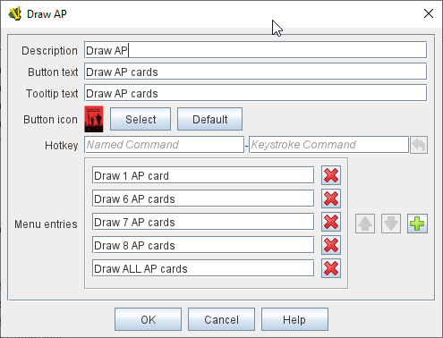

== VASSAL Reference Manual
[#top]

[.small]#<<index.adoc#toc,Home>> > <<GameModule.adoc#top,Module>> > *Toolbar Menu*#

'''''

=== Toolbar Menu

The Toolbar Menu component lets you group buttons from the <<Toolbar.adoc#top,Toolbar>> of the main <<GameModule.adoc#top,Module>> window or a <<Map.adoc#top,Map>> window into a drop-down menu.
Each button named in this component will be removed from the Toolbar and instead appear as a menu item in the drop-down menu.

[width="100%",cols="50%a,^50%a",]
|===
|
*Description:*:: A brief description for your own use.

*Button text:*:: The text of the new button to be added to the <<Toolbar.adoc#top,Toolbar>>. Clicking the button will reveal the drop-down menu.

*Tooltip text:*:: Tooltip text for the new <<Toolbar.adoc#top,Toolbar>> button.

*Button Icon:*:: Icon for the new <<Toolbar.adoc#top,Toolbar>> button.

*Hotkey:*:: <<NamedKeyCommand.adoc#top,Keystroke or Named Command>> for revealing the drop-down menu.

*Menu Entries:*:: Enter the exact _Button Text_ of the <<Toolbar.adoc#top,Toolbar>> buttons that you wish to move to the drop-down menu.
The menu item will have the same text.
If the button uses an icon, the menu item will also use it.
The items moved to the drop-down menu will appear in the order they are listed.

NOTE: You must use the _Button Text_ of the buttons, not a Hotkey _Named Command._
|image:images/ToolbarMenuExample.png[]

_Example of a Toolbar Menu with a submenu._

_The corresponding Toolbar Menu configuration._
|===
