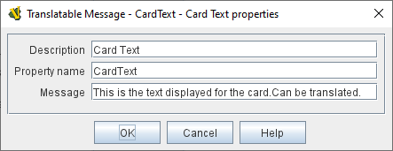

== VASSAL Reference Manual
[#top]

[.small]#<<index.adoc#toc,Home>> > <<GameModule.adoc#top,Module>> > <<PieceWindow.adoc#top,Game Piece Palette>> > <<GamePiece.adoc#top,Game Piece>> > *Translatable Message*#

=== Translatable Message

[cols=",",]
|===
|A Translatable Message trait marks a game piece permanently as always having a particular _translatable_ <<Properties.adoc#top,Property.>> Unlike many other types of Properties that can be configured on and by pieces (e.g.
<<DynamicProperty.adoc#top,Dynamic Properties>>), a Marker's value cannot change during play.
In other words, it is like a _constant_ rather than a _variable_ in programming. The difference between a Translatable Message and
a <<PropertyMarker.adoc#top, Marker>> trait is that a Translatable Message's value is designed to be used to display text that
may be translated into different languages (example: card text).

Markers can be referenced in <<MessageFormat.adoc#top,Message Formats>>, and in <<Expression.adoc#top,Expressions>> used to create display text. Although they work much like other properties, it is NOT recommended to use them in expressions and traits that change the game state (because they will hold different values when
the module is run in English from when it is run in e.g. Spanish).

*Description:* Optional short description of the trait or message. Has no effect during gameplay, just exists as a "comment" for organizing the module.

*Property Name:*  The name of the property.
This is how the property can be referenced in <<Expression.adoc#top,Expressions>> and <<MessageFormat.adoc#top,Message Formats>>.

*Message:*  The translatable message contained in this trait. This message will remain constant for this piece throughout play, but other pieces could have a Translatable Message of the same property name but with a different message.

*SEE ALSO:*  <<PropertyMarker.adoc#top, Marker>>, <<DynamicProperty.adoc#top,Dynamic Property>>, <<SetGlobalProperty.adoc#top,Set Global Property>> | +
|===
