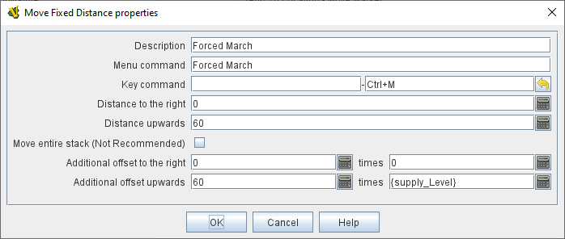

== VASSAL Reference Manual
[#top]

[.small]#<<index.adoc#toc,Home>> > <<GameModule.adoc#top,Module>> > <<PieceWindow.adoc#top,Game Piece Palette>> > <<GamePiece.adoc#top,Game Piece>> > *Move Fixed Distance*#

'''''

=== Move Fixed Distance

Defines a command to move the piece a fixed X and Y distance using <<Expression.adoc#top,Expressions>> to control the amount of movement on each axis.

*EXAMPLE:* An army unit can conduct a forced march for extra movement.
The amount of additional movement depends on its supply, which is tracked by a <<Layer.adoc#top,Layer>> trait.
The Move Fixed Distance trait is given an additional offset of one hex times the value of the supply level.

*SEE ALSO:*  <<Rotate.adoc#top,Can Rotate>>, <<Pivot.adoc#top,Can Pivot>>

[width="100%",cols="50%a,^50%a",]
|===
|

*Description:*::  A brief description for this trait that appears in the <<GamePiece.adoc#top,Piece Definer window>> for the piece.
Useful, for example, to distinguish between several versions of this trait.

*Menu command:*::  Text that appears on the piece's right-click context menu.
If left blank, no context menu item will appear, but the trait can still be activated to move the piece using the key command.

*Key Command:*::  <<NamedKeyCommand.adoc#top,Keystroke or Named Command>> to initiate the movement.

*Distance to the right:*::  An <<Expression.adoc#top,Expression>> specifying the distance to move the piece to the right.
Use negative numbers to move the piece to the left.

*Distance upwards:*::  An <<Expression.adoc#top,Expression>> specifying the distance to move the piece upwards.
Use negative numbers to move the piece down.

*Move entire stack:*::  Check this option to cause the entire stack containing the piece to be moved, if the stack is not expanded.
Otherwise, only this piece will be moved.

NOTE: This option has been left in to maintain compatibility with older modules. Its use is not recommended.

*Additional offsets:*::  Use these offset values to give more control over the movement.
The two numbers specified in the <<Expression.adoc#top,Expressions>> on the first line for movement right, and the two numbers in the second line for movement upwards are multiplied together and added to the right/up distances defined in the basic options.

NOTE:  If this piece has a <<Rotate.adoc#top,Can Rotate>> trait listed _before_ this trait, then the resulting direction will be relative to the current facing of the piece.
_Example:_ If a piece has traits _Can Rotate_ followed by _Move Fixed Distance_ 60 upwards, then the move command will move the piece in whatever direction the top of the piece is facing.
If a piece has traits _Move Fixed Distance_ 60 upwards followed by _Can Rotate_ then the move command will move the piece towards the top of the screen regardless of the facing of the piece.

| +
|===

'''''
