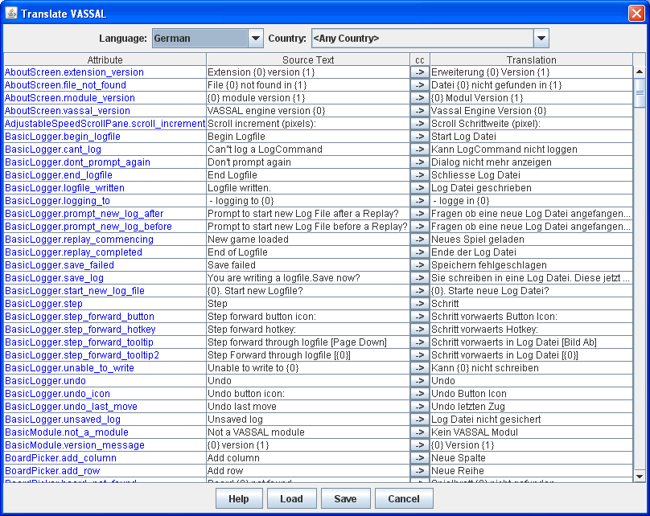
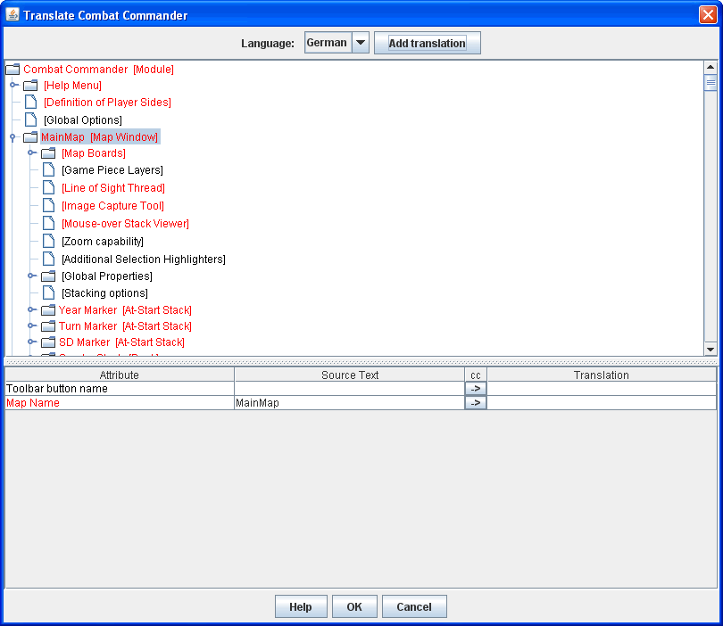

== VASSAL Reference Manual
[#top]

[.small]#<<index.adoc#toc,Home>> > *Translations*#

'''''

=== Translations

VASSAL supports languages other than English.
Support is divided into two areas:

* The core application (i.e.
the menus, preferences, dialog messages, etc.) supports a certain set of languages, depending on the VASSAL release version.
If you would like to contribute a translation, follow the <<#application,Translating the VASSAL Application>> instructions.
You will need to submit your translation to the VASSAL development team for inclusion in the next release.
* Individual modules (i.e.
the button and menu text, Map and Game Piece names, and other strings specified via the module editor) can be translated into any language, even if the core application does not support that language.
Follow the <<#module,Translating a VASSAL Module>> instructions to translate a module.

[#application]
==== Translating the VASSAL Application

To translate the core VASSAL application, run VASSAL from the command line with the `--translate` option.
In the resulting dialog window, select the language (and optional country) that you are creating a translation for.
In the lower part of the window, enter the translation for each phrase listed.
Use the _Load_ button to load a translation file created during a previous editing session.
When complete, hit the _Save_ button to save the translation file.
The default location is the VASSAL home directory.
When you restart, VASSAL will look in its home directory for a translation file corresponding to your computer's locale.

When your translation file is complete, send it by email to _support@vassalengine.org_.
It will be bundled with the next VASSAL release for use by other players worldwide!

'''''

[#module]
==== Translating a VASSAL Module

You can translate a module into another language by editing the module or by creating a module extension.
Right-click on the Module folder in the edit window and select _Translate_.
In the resulting dialog window, click the _Add Translation_ button and select the language/country combination that you are creating a translation for.
The upper part of the window shows the module structure.
Any components with phrases requiring translation are highlighted in red.
Navigate to any component and enter the phrase translations in the lower part of the window.

When your translation is complete, save the module or module extension.
When a user loads the module, VASSAL will use the translation appropriate for the user's computer.
It is not necessary for module translations to be bundled into a VASSAL release, and an extension containing a translation can be distributed independently of the module itself.

When running a translated module, the properties `CurrentLanguage` (e.g. "en", "fr", "es") and `CurrentLanguageName` (e.g. "English") are visible to the module.

_Note:  A module is not translated when opened in edit mode; module translations are *only* applied in play mode._
