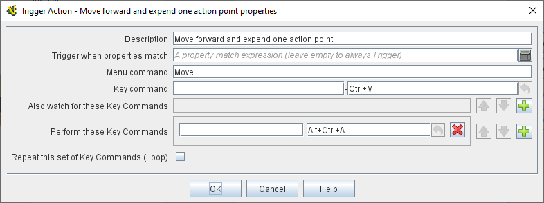
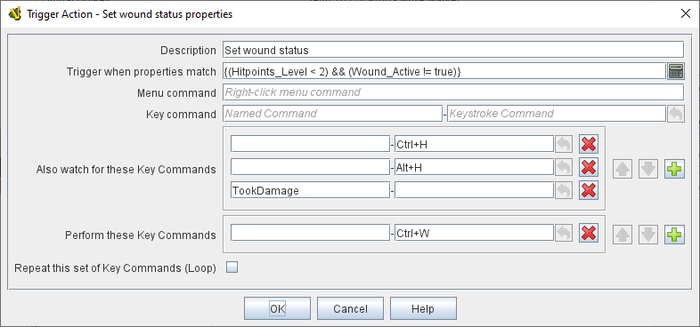
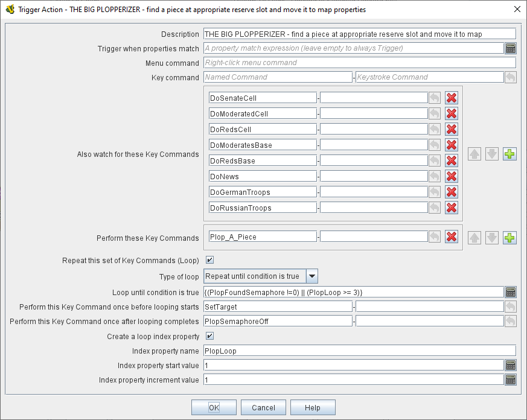

== VASSAL Reference Manual
[#top]

[.small]#<<index.adoc#toc,Home>> > <<GameModule.adoc#top,Module>> > <<PieceWindow.adoc#top,Game Piece Palette>> > <<GamePiece.adoc#top,Game Piece>> > *Trigger Action*#

'''

=== Trigger Action Trait

Trigger Action is a multi-purpose trait which is used to activate one or more other traits of the same piece.
You can use it to combine commands into one, to automatically fire commands in response to other commands (including <<GlobalKeyCommand.adoc#top,Global Key Commands>>) when certain conditions apply, or to fire off multiple commands at a time.

image:images/GamePieceOrder.png[]

When combining multiple Trigger Actions and key commands into sophisticated behaviors, the principles of <<GamePiece.adoc#TraitOrder,Trait Order>> should be reviewed.
When a <<NamedKeyCommand.adoc#top,Keystroke or Named Command>> is received by a Game Piece (whether by an actual key being pressed by the player or from a Trigger Action trait), the <<GamePiece.adoc#Traits,Traits>> are visited in a particular order to see if they listen for that Key Command, and if they do have an entry for that Key Command the appropriate part of the Trait activates.

The order Traits _within_ the piece are visited is as follows:

First any traits _except for_ Trigger Action and Report Action traits are visited.
This happens starting at the bottom of the list and proceeding up toward the <<BasicPiece.adoc#top,Basic Piece>> trait.

Then, once every trait that isn't a Trigger Action or Report Action trait has been visited, we then visit those traits, this time starting at the _top_ of the list just beneath the Basic Piece trait and proceeding towards the bottom.

 *Description:*::  A brief description of the trait which will appear in the <<GamePiece.adoc#top,Piece Definer window>> for the piece or prototype.
Particularly useful in distinguishing multiple _Trigger Action_ traits from one another.

*Trigger when properties match:*::  If not left blank, the trait will only generate new key commands if the piece matches this <<PropertyMatchExpression.adoc#top,Property Expression>>.

*Menu Command:*::  Adds an item to the piece's right-click context menu that will fire the triggered commands (provided the property expression is matched).

*Key command:*::  A <<NamedKeyCommand.adoc#top,Keystroke or Named Command>> corresponding to the menu item.
The only functional difference between putting a entering a command here and entering it in the _Watch for these Keystrokes_ field below is that if a regular keyboard shortcut is entered here it will appear alongside the _Menu Command_ text above in the right-click context menu item for this trait as the shortcut for that item.
Apart from that, use of this field is interchangeable with the _Watch for these Keystrokes_ field.

*Watch for these Key Commands:*::  When any of these <<NamedKeyCommand.adoc#top,Keystrokes and/or Named Commands>> is detected, fires the keystrokes listed below (in _Perform these Keystrokes_), provided the property expression (if any) is matched.
+
Key commands can be detected, for example, when one of the other traits on the piece is activated by the player pressing that trait's keyboard shortcut or selecting the corresponding item from the right-click context menu.
Key commands can _also_ be detected when sent from elsewhere via a <<GlobalKeyCommand.adoc#top,Global Key Command>> or when chained from another _Trigger Action_ trait on this piece, allowing you to set up complex chaining and forking behaviors.
Click the _Add_ button to add additional fields to accomodate more keystrokes.
To remove unwanted keystrokes, simply blank the lines -- extra lines will be removed next time you open the trait's properties.

*Perform these Key Commands:*::  The <<NamedKeyCommand.adoc#top,Keystrokes and/or Named Commands>> to invoke for this piece whenever one of the above key commands (in the _Perform these Keystrokes_ and/or _Keyboard Command_ fields) is observed, provided that the property expression (if any) is matched.
Click the _Add_ button to add additional fields to accomodate more keystrokes.
To remove unwanted keystrokes, simply blank the lines -- extra lines will be removed next time you open the trait's properties.

*Repeat this set of Key Commands (Loop):*::  If checked, allows you to define logic for a "loop" to generate the specified key commands multiple times.
Otherwise the listed key commands are triggered once each.

*Type of loop:*:: lets you configure your loop.
+
_Repeat fixed number of times_  This loop option allows you to repeat the set of key strokes a specified number times.
+
_Repeat while condition is true_  This loop option allows you to repeat the set of key strokes *while* a <<PropertyMatchExpression.adoc#top,Property Expression>> remains true.
If the expression initially evaluates as false, the key strokes will not be issued at all (compare with the _until_ condition below).
+
_Repeat until condition is true_  This loop option allows you to repeat the set of key strokes *until* a <<PropertyMatchExpression.adoc#top,Property Expression>> becomes true.
The key commands will be issued at least once before the expression is checked for the first time.

*Loop how many times:*::  An <<Expression.adoc#top,Expression>> that defines how many times to generate the set of key commands (for a fixed loop).

*Loop while/until condition is true:*::  Enter the <<PropertyMatchExpression.adoc#top,Property Expression>> that controls how long to keep looping (for a while or until loop).

*Perform this Key Command once before looping starts:*::  For all loop types, enter an optional <<NamedKeyCommand.adoc#top,Keystroke or Named Command>> that will be performed once before the looping process commences.

*Perform this Key Command once after looping complete:*::  For all loop types, enter an optional <<NamedKeyCommand.adoc#top,Keystroke or Named Command>> that will be performed once after the looping process finishes.

*Create a loop index property:*::  For all loop types, allows you to create a Property whose value will change as the looping process proceeds.

*Index property name:*::  The name of the property that will be created.

*Index property start value:*::  An <<Expression.adoc#top,Expression>> that sets the value of the index property prior to looping commencing.
The expression must evaluate to a whole number.

*Index property increment value:*::  An <<Expression.adoc#top,Expression>> that defines how much will be added to the Index Property at the start of each loop.
The expression must evaluate to a whole number.

'''

*Example #1:*  Your module's main <<Map.adoc#top,Map>> has an entry in its field for _Key Command to apply to all units ending movement on this map_ (the last field on the Map's properties configuration dialog) which is configured to send the <<NamedKeyCommand.adoc#top,Named Command>> "MovedOnMap" to every piece that moves.
Your piece then uses a _Trigger Action_ trait that watches for the _MovedOnMap_ Named Command.
It checks to make sure the piece has actually changed locations (as opposed to simply being adjusted in its space), and if the piece has truly changed locations then it fires two additional key commands: one will lower a count of its piece type for the region it has just left, and the second will increase the count of its piece type in the region in which it has just arrived.

image:images/TriggerAction.png[]

'''
*Example #2:*  A piece has a <<Layer.adoc#top,Layer>> to track action points and a <<Translate.adoc#top,Move Fixed Distance>> trait to move it forward.
The Move Fixed Distance trait can be assigned a Named Command such as _MoveForward_) with no command name (so that it does not appear in the right-click context menu). Then a Trigger Action trait with the command Move and the keystroke Ctrl+M can trigger both the Move command and decrease the action points layer by one.

'''

*Example #3:*  A piece has separate <<Layer.adoc#top,Layer>> traits for hit points and for a "critically wounded" status for when the hit points are less than 2.
A Trigger Action trait can watch for the keystrokes that affect the hit-point layer and respond by activating the wounded layer by matching the property expression for when the hit points are < 2 and the wound level is not active.

'''

*Example #4:*  A trait that is activated whenever any of a whole list of types of piece are due to be placed on the map.
It performs a looping function to look for a piece of the appropriate type in a prioritized list of places to find them (e.g.
"in the force pool", "in the reserve", "in the dead pool", etc), and stops when it either places a piece successfully or when it runs out of places to look.

