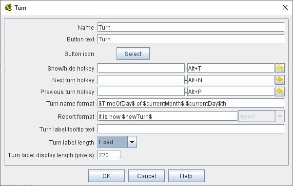
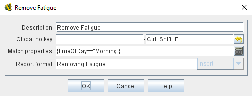

== VASSAL Reference Manual
[#top]

[.small]#<<index.adoc#toc,Home>> > <<GameModule.adoc#top,Module>> > *Turn Counter*#

'''''

=== Turn Counter

A Turn Counter places a button and/or widget on the <<Toolbar.adoc#top,Toolbar>> of the Module window which keeps track of the current turn/phase/sub-phase, etc.
of a game.
Players can advance the turn forward or backward, or optionally jump directly to a turn.

To add a Turn Counter to your module, right click on the _[Module]_ component at the very top of the Editor's configuration window list, and select _Add Turn Counter_.
Then, after configuring its fields appropriately, you will find your new component's _[Turn Counter]_ component entry at the bottom of the Module's list of components.
You can right-click on the _[Turn Counter]_ component entry to add sub-components to represent levels within your Turn structure (see details and examples below).

[cols=",",]
|===
|image:images/TurnTrackerTurnWindow.png[]|image:images/TurnTrackerExample.png[]|===

The Turn Counter is defined as a series of nested levels, each represented by a sub-component of the Turn Counter.
"Advancing the turn" moves the _deepest_ level forward.
When a level wraps around, the next level above it (but under the same parent) advances forward.
When the last, outermost, child level has wrapped around, the parent level itself advances forward.

_*Example (see screenshots above and below):* A level representing the Month may contain a level representing the Day, which in turn contains a level representing Morning/Evening.
Advancing the turn moves from morning to evening, then to morning of the next day, etc.
Configuration for this example can be seen in the various screenshots throughout this article._

Each level of the Turn Counter exposes its value as a module <<Properties.adoc#top,Property>>. A hotkey can be configured to fire when a certain combination of levels is reached.

The Turn Counter controls can be docked into the main Module Toolbar, or can be opened in a separate window that is shown/hidden via a button on the Toolbar.
Whether the controls are docked is remembered in the player's preferences.

*Name:*  A name for display in the <<Editor.adoc#top,Editor>> window

*Button text:*  The text of the <<Toolbar.adoc#top,Toolbar>> button to show/hide the controls when un-docked

*Button Icon:*  Icon for the <<Toolbar.adoc#top,Toolbar>> button.

*Button Tooltip:*  Optional tooltip text for the <<Toolbar.adoc#top,Toolbar>> button.

*Show/hide Hotkey:*  Keyboard shortcut or <<NamedKeyCommand.adoc#top,Named Key Command>> to hide or show the Turn Counter window when un-docked.

*Next Turn Hotkey:*  Keyboard shortcut or <<NamedKeyCommand.adoc#top,Named Key Command>> to advance the Turn Counter one step.
The turn can also be advanced by clicking the "+" button displayed to the right of the turn when the turn counter is visible.

*Previous Turn Hotkey:*  Keyboard shortcut or <<NamedKeyCommand.adoc#top,Named Key Command>> to return the Turn Counter to the previous step.
The turn can also be moved back by clicking the "-" button displayed to the left of the turn when the turn counter is visible.

*Turn Name Format:*  <<MessageFormat.adoc#top,Message Format>> to format the display of the current turn in the counter.
All module-level <<Properties.adoc#top,Properties>> will be substituted.
In particular, the properties exposed by any sub-components (Counters or Lists) can be used.
In addition, the special properties _level1, level2_, etc.
can be used to represent the values of the active Counter or List within the Turn Counter.
_Example:_ If the Turn Counter contains a Month level that contains a Day level, then__level1__ gives the value of the Month and__level2__gives the Day.

*Report Format:*  <<MessageFormat.adoc#top,Message Format>> to display a message in the <<ChatLog.adoc#top,Chat Log>> whenever the turn changes.

*Turn Label Tooltip Text:*  Tooltip text for the Turn Display.

*Turn Label Display Length:*  Set the number of pixels wide the turn display label should be, or use 0 to let it float to suit the current turn display.

'''''

=== Sub-Components

To add a new level to your Turn Counter, open the <<Editor.adoc#top,Editor>> and navigate to your _[Turn Counter]_ component.
Right-click on the _[Turn Counter]_ component and select _Add List_ or _Add Counter_ , depending on whether you want the level to be a list (e.g.
"Spring", "Summer", etc) or a numeric value (e.g.
1914, 1915, etc). You can then optionally right-click on the new _[List]_ or _[Counter]_ you've just added, to add another level beneath it, and so forth.

You can also add a Global Hotkey to your Turn Counter (see below).

[#List]
==== List

A List is a turn level that cycles through a specified list of text strings.

[cols=",",]
|===
|*Description:*  A brief description of this turn level, which will appear in the Editor's configuration window.

*Property Name:*  The name of the global <<Properties.adoc#top,Property>> that will hold the value of this level.
The Global Property will be updated whenever this level's value changes.

*Turn Level Format:*  A <<MessageFormat.adoc#top,Message Format>> that specifies how the value of the _level1, level2,_ etc property will appear in the Turn Counter's Turn Name Format property.

*List of Items*:  A list of text strings that the level will cycle through.

*Allow players to hide items in this list:*  If selected, then players will be allowed to disable items in this list at game time.

*Allow players to change which item goes first:*  If selected, then players will be allowed to change which should be the beginning item in the list, i.e.
the item at which the parent level will be advanced.
_Example:_   If a List represents sides in a game, but the order in which sides move is not always fixed.

||===

[#Counter]
==== Counter

A Counter is a numeric turn level that advances by incrementing the value by a fixed amount.
It can optionally loop around when it reaches its maximum value.

[cols=",",]
|===
|*Description:*  A brief description of this turn level, which will appear in the Editor's configuration window.

*Property Name:*  The name of the global <<Properties.adoc#top,Property>> that will hold the value of this level.
The Global Property will be updated whenever this level's value changes.

*Turn Level Format:*  A <<MessageFormat.adoc#top,Message Format>> that configures how the value of the _level1, level2,_ etc property will appear in the Turn Counter's Turn Name Format property.

*Start Value:*  The initial/minimum numeric value.

*Increment By:*  The amount by which the numeric value increases when the level advances.

*Loop:*  If selected, the level will return to its starting value after reaching the maximum value.

*Maximum value:*  The maximum value, after which the level will loop.
|
|===

[#Hotkey]
==== Global Hotkey

A Global Hotkey sub-component of a Turn Counter fires a key command or <<NamedKeyCommand.adoc#top,Named Key Command>> whenever a certain state of the Turn Counter is reached.

_Example:_  When the Refit phase is reached, a hotkey can fire that corresponds to the keyboard shortcut of a <<Map.adoc#GlobalKeyCommand,Global Key Command>> that removes all Damage counters from pieces on the map.

[cols=",",]
|===
|*Description:*  A brief description of this subcomponent, for display in the Editor's configuration window.

*Global Hotkey:*  The keyboard shortcut or <<NamedKeyCommand.adoc#top,Named Key Command>>: to fire.
The module will respond exactly as if one of the players had pressed this key or selected a menu item corresponding to a named key command.

*Match Properties:*  A <<Properties.adoc#top,Property Expression>> that specifies when to fire the hotkey or Named Key Command.
If the expression is true after any level of the Turn Counter advances, the hotkey will fire.

*Report Format:*  A <<MessageFormat.adoc#top,Message Format>> that will be echoed to the chat log when the hotkey fires.
|
|===
