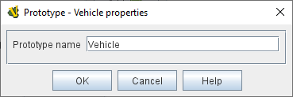

== VASSAL Reference Manual
[#top]

[.small]#<<index.adoc#toc,Home>> > <<GameModule.adoc#top,Module>> > <<PieceWindow.adoc#top,Game Piece Palette>> > <<GamePiece.adoc#top,Game Piece>> > *Prototype (Trait)*#

'''''

=== Prototype (Trait)

The Prototype trait allows a piece to share a set of common traits with other pieces.
The traits themselves are defined elsewhere in a <<Prototypes.adoc#top,Prototype Definition>> in the _[Global Piece Prototype Definitions]_ section of your module.
A Game Piece may contain any number of Prototype traits, intermixed with regular traits, in any order.

*EXAMPLE:*  A Prototype named _Vehicle_ can be defined with _Can Rotate_, _Text Label_, and _Mark When Moved_ traits.
Any counter can use these traits by using a Prototype trait and specifying _Vehicle_ as the name.
If the module author later decides that vehicles should also have another trait, it need only be added to the Prototype definition, and all game pieces with a _Prototype - Vehicle_ trait will automatically gain the new trait.
Similary, modifying or deleting a trait from a Prototype will change or remove that trait for all pieces that reference the Prototype.

**Prototype Name:**:: Type the name of your prototype here - the name you gave it to its <<Prototypes.adoc#top,prototype definition>>. Alternatively you can click the _Select_ button to pick the prototype from the list of all the ones you have created.

**Select:**:: The _Select_ button allows you to select one of the prototypes you have defined in the module. If your prototypes have been organized into folders, the folders will appear a submenus.

image:images/UsePrototype2.png[]]

*SEE ALSO:* <<Prototypes.adoc#top,Prototypes (Definition)>>
