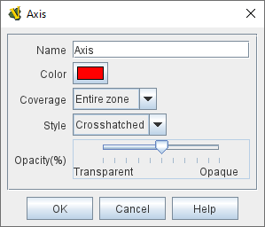

== VASSAL Reference Manual
[#top]

[.small]#<<index.adoc#toc,Home>> > <<GameModule.adoc#top,Module>> > <<Map.adoc#top,Map>> > <<Board.adoc#top,Board>> > *Multi-zoned Grid*#

'''''

=== Multi-zoned Grid

A multi-zoned grid allows you to define any number of sub-regions of a board.
Each sub-region, called a <<#Zone,Zone>>, can have its own grid and naming format, which takes precedence over the default grid.
For example a board with a <<HexGrid.adoc#top,Hex Grid>> may have Zones along the edge for a turn track or force pools.
Pieces will snap to position in the appropriate zone (if that is selected in the options for the Zone's grid) and auto-reporting will use text supplied by the Zone.

'''''

=== Sub-Components

[#Zone]
==== Zone

Each Zone can have an arbitrary shape, which you specify in the _Define Shape_ dialog.
Each Zone may also define its own grid.
When defining a Zone's grid, the offsets and numbering are relative to the edge of the overall board, not the zone's edge.

A Zone may contain <<GlobalProperties.adoc#top,Properties>>. Zone Properties may not have a Change-Property Toolbar Button, but can be modified by a <<SetGlobalProperty.adoc#top,Set Global Property>> Game Piece trait

[width="100%",cols="50%a,^50%a",]
|===
|

*Name:*::  The name of the Zone.
This is how the Zone will be referred to elsewhere in the module, for example when using a <<SendToLocation.adoc#top,Send To Location>> trait to send a piece to a particular Zone.

*Location format:*::  A <<MessageFormat.adoc#top,Message Format>> that will be used to populate the _LocationName_ <<Properties.adoc#top,Property>> of pieces in this zone.

NOTE: This property is used not only for auto-reporting of moves, but _also_ by other traits such as the <<SendToLocation.adoc#top,Send To Location>> trait if a piece is sent to a Region in an <<IrregularGrid.adoc#top,Irregular Grid>>. The typical formats are _$name$_ to simply use name of this Zone for every location within the zone, or _$gridLocation$_ to use the location name according to this zone's grid.

*Shape:*:: Click this button to bring up a dialog for defining the shape of this zone.
To create the initial shape, drag the mouse to define a rectangle.
Then right-click to add new points and use the mouse to drag points to their final locations.
Delete a point by clicking on it and hitting the DEL key.

*Use board's grid:*:: If selected, then this Zone will use the grid from the containing board instead of defining its own grid.
Otherwise, one of the normal types of grid should be added to the Zone, by right-clicking its entry in the Editor and selecting an "Add" option for the desired type of grid (<<HexGrid.adoc#top,Hex>>, <<RectangularGrid.adoc#top,Rectangular>>, or <<IrregularGrid.adoc#top,Irregular>>).

*Use Highlighting:*:: If selected, you must also specify the name of a <<Properties.adoc#top,Property>> . The value of the property will determine which <<#ZoneHighlighter,Zone Highlighter>> is used to draw the zone.

|  +

image:images/ZoneGrid.png[]
|===

[#ZoneHighlighter]
==== Zone Highlighter
Any number of Zone Highlighters can be added to a Multi-Zone grid.
Any Zone whose highlighting property matches the name of a Zone Highlighter will be drawn with that highlighter, which overlays a colored pattern over the shape of the Zone.

[width="100%",cols="50%a,^50%a",]
|===
|
*Name:*::  The name of the highlighter.

*Color:*::  The color of the highlight.

*Coverage:*::  Select _Entire Zone_ to overlay the entire shape of the zone.
+
Select _Zone Border_ to overlay only the border of the Zone.

*Style:*::  Select from solid color, striped diagonal lines, crosshatched diagonal lines, or an image that you specify.

*Image:*:: The image to use for highlighting if the _Image_ style is selected.

*Opacity(%):*::  Select the transparency of the overlaid color or image.

|  +
  +
|===

==== Default Grid

A grid can be added directly to a Multi-zone grid, and becomes the "default grid". If a given point does not fall within any of the defined Zones for a Multi-zone grid, the default grid is used.
The default grid may be any of the usual types of grid:

==== <<HexGrid.adoc#top,Hex Grid>>

==== <<RectangularGrid.adoc#top,Rectangular Grid>>

==== <<IrregularGrid.adoc#top,Irregular Grid>>

